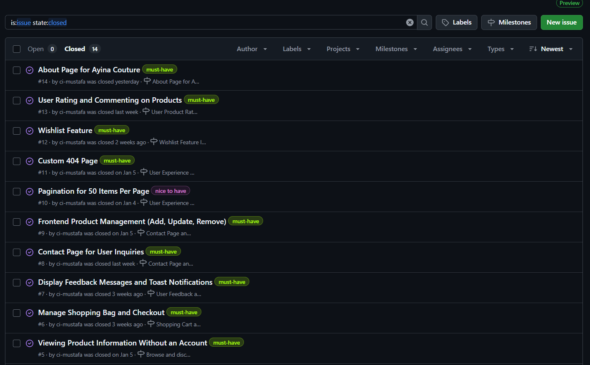
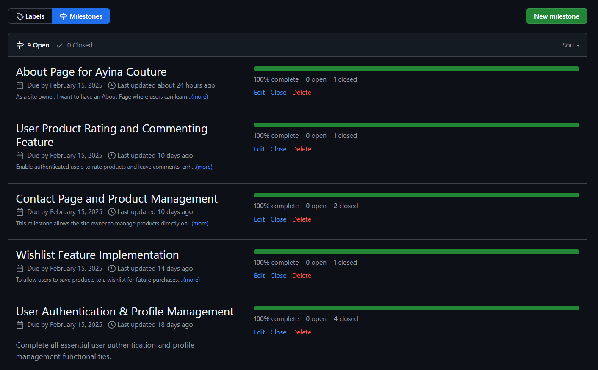
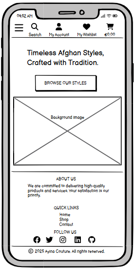
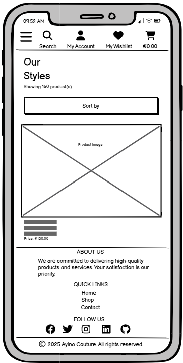
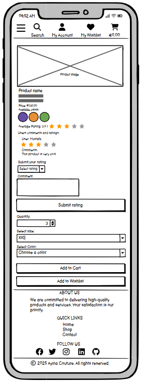
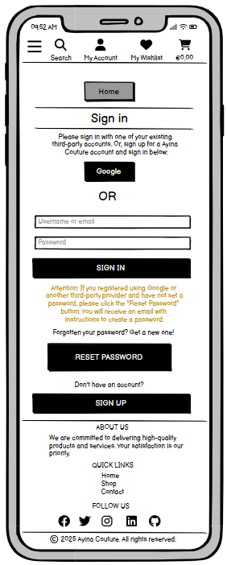
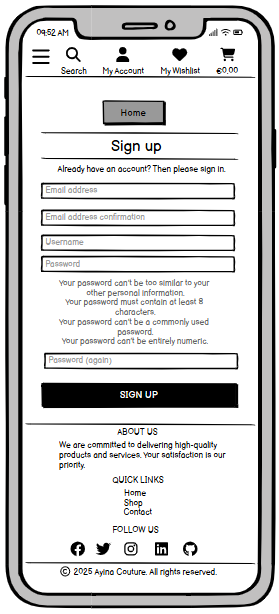
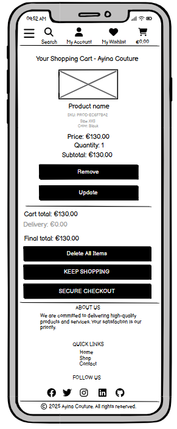
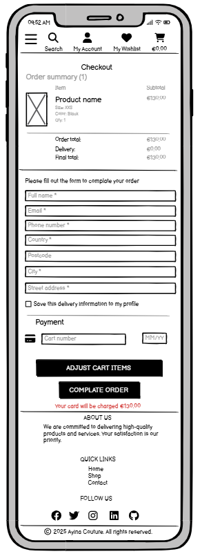

# Ayina Couture - Traditional Afghan Clothing

Welcome to Ayina Couture, an online store dedicated to authentic Afghan traditional clothing. This app allows users to explore and purchase beautifully handcrafted garments that celebrate Afghanistan’s rich cultural heritage.

Some features on the site are available exclusively to registered users, including viewing order history, saving items to a wishlist, and adding product reviews.

Users can browse collections, search for products, view detailed descriptions, add items to their cart, and securely complete their purchase. 

[Live link to Ayina Couture](https://ayina-couture-32f4a278cf2b.herokuapp.com/)

 

# Table of Contents

1. [UX](#ux)
2. [The Strategy Plane](#the-strategy-plane)
    * [Targeted Users](#targeted-users)
    * [Site Goals](#site-goals)
    * [Project Goals](#project-goals)
3. [Agile Planning](#agile-planning)
    * [User Stories](#user-stories)
4. [Fundamental Structure](#fundamental-structure)
    * [Wireframes](#wireframes)
    * [Database Schema](#database-schema) 

 

# UX

## The Strategy Plane

### Targeted Users

- Individuals interested in Afghan traditional clothing and culture.
- Customers looking for high-quality handcrafted garments.
- Fashion enthusiasts who appreciate cultural and artisanal craftsmanship.
- Afghan diaspora seeking to connect with their heritage through fashion.
- Gift shoppers looking for unique and elegant clothing items.

### Site Goals

- Provide an intuitive and visually appealing online shopping experience.
- Showcase the rich cultural heritage of Afghanistan through traditional clothing.
- Support Afghan artisans by promoting handmade and authentic designs.
- Ensure a seamless checkout process with multiple payment options.
- Offer customer accounts for order tracking, wishlists, and personalized shopping experiences.
- Implement a feedback system to improve customer experience.

### Project Goals

- Develop a responsive and user-friendly e-commerce platform.
- Integrate secure payment processing for a smooth checkout experience.
- Enable product filtering, searching, and categorization for easy navigation.
- Ensure fast loading speeds and mobile compatibility.
- Create an admin panel for efficient inventory and order management.
- Establish trust and credibility with clear policies on shipping, returns, and customer service.

 

[Back to Top](#table-of-contents)

 

## **Agile Planning**

Ayina Couture followed an Agile development approach, ensuring a user-centric and iterative process. The project was structured around user stories, each carefully planned and assigned to specific iterations.
To streamline development efforts, user stories were classified into two priority levels:

- Must-Have – Core functionalities essential for the website to operate efficiently.
- Nice-to-Have – Additional features that enhance user experience but are not critical for the initial launch.

The Project board [here](https://github.com/users/ci-mustafa/projects/5).

[Back to Top](#table-of-contents)

 

## User Stories

* A comprehensive project implementation plan was developed based on in-depth analysis and evaluation of user stories.
You can explore the detailed user stories [here](https://github.com/ci-mustafa/ayina-couture/issues?q=is%3Aissue%20state%3Aclosed).

* Each user story in the project is aligned with a specific milestone, ensuring a structured and iterative development process. By linking user stories to milestones, we maintain clear progress tracking, prioritize essential features, and systematically enhance the platform’s functionality. This approach allows for continuous improvements while ensuring that critical objectives are met efficiently.

[Back to Top](#table-of-contents)

 

## Fundamental Structure

### Wireframes

- To streamline the website's design process, I created detailed wireframes for each page, ensuring a user-friendly and responsive layout. Following best practices, wireframes were designed for both mobile and desktop dimensions to optimize the user experience across all devices. I utilized [Balsamiq](https://balsamiq.com/) to develop these wireframes, covering key views such as Home, Login, Logout, Products, Product detail, Cart and Checkout. These visual blueprints provided a clear structure for the site's layout and functionality, guiding the development process effectively.

### Mobile view Wireframes

Click to View Home Page wireframes

#### Mobile Home

Click to View product page wireframes

#### Mobile Products

Click to View product detail page wireframes

#### Mobile Product detail

Click to View sign in page wireframes

#### Mobile Sign in

Click to View sign up page wireframes

#### Mobile Sign up

Click to View cart page wireframes

#### Mobile Cart

Click to View cart page wireframes

#### Mobile Checkout

