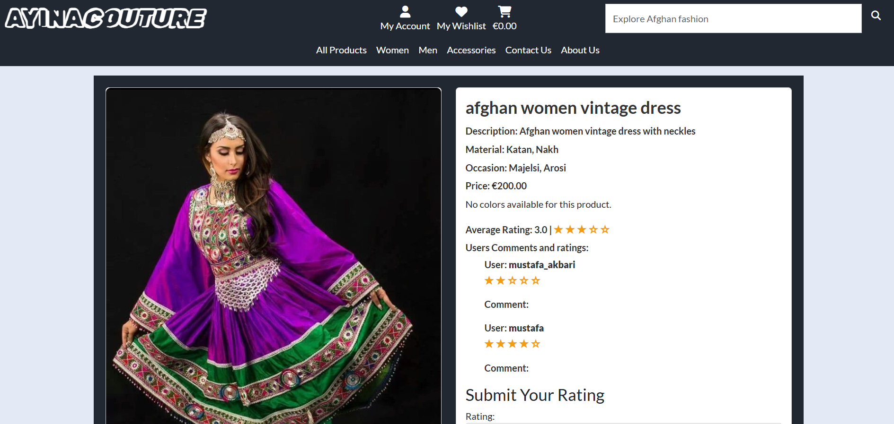
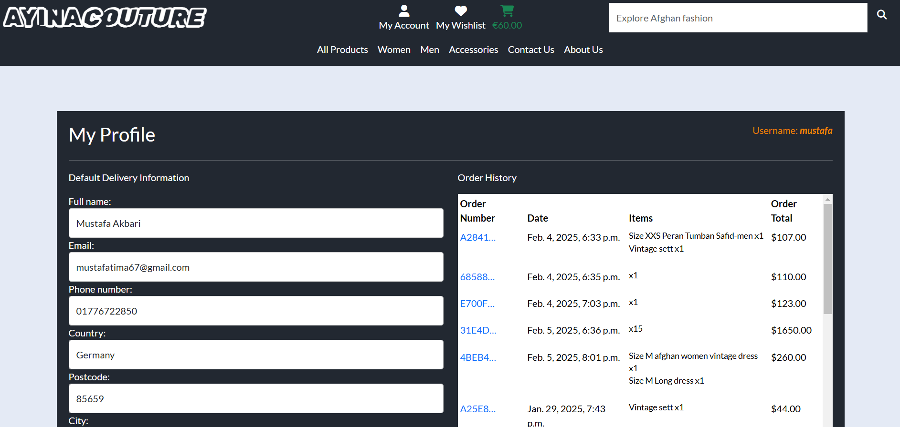
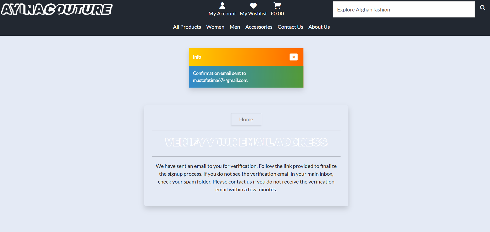

# Ayina Couture - Traditional Afghan Clothing


Welcome to Ayina Couture, an online store dedicated to authentic Afghan traditional clothing. This app allows users to explore and purchase beautifully handcrafted garments that celebrate Afghanistan’s rich cultural heritage.

Some features on the site are available exclusively to registered users, including viewing order history, saving items to a wishlist, and adding product reviews.

Users can browse collections, search for products, view detailed descriptions, add items to their cart, and securely complete their purchase. 

[Live link to Ayina Couture](https://ayina-couture-32f4a278cf2b.herokuapp.com/)

<br>

# Table of Contents

1. [UX](#ux)
2. [The Strategy Plane](#the-strategy-plane)
    * [Targeted Users](#targeted-users)
    * [Site Goals](#site-goals)
    * [Project Goals](#project-goals)
3. [Agile Planning](#agile-planning)
    * [User Stories](#user-stories)
4. [Fundamental Structure](#fundamental-structure)
    * [Wireframes](#wireframes)
    * [Database Schema](#database-schema) 
5. [Main plan](#main-plan)
6. [Features](#features )
7. [Features Left To Implement](#features-left-to-implement)
8. [Design](#design)
    * [Colour Scheme](#colour-scheme)
    * [Typography](#typography)
    * [Images](#images)
9. [Business Model](#business-model)
10. [Marketing Strategy](#marketing-strategy)
11. [Search Engine Optimization (SEO)](#search-engine-optimization-seo)
12. [Technologies](#technologies)
    * [Strip payment integration](#strip-payment-integration)
    * [Languages Used](#languages-used)
    * [Frameworks Used](#frameworks-used)
    * [Libraries And Installed Packages](#libraries-and-installed-packages)
    * [Tools and Resources](#tools-and-resources)
13. [Testing](#testing)
14. [Bugs](#bugs)
15. [Credits](#credits)
16. [Deployment and Local Developement](#deployment-and-local-developement)
17. [Acknowledgements](#acknowledgements)


<br>

# UX

## The Strategy Plane

### Targeted Users

- Individuals interested in Afghan traditional clothing and culture.
- Customers looking for high-quality handcrafted garments.
- Fashion enthusiasts who appreciate cultural and artisanal craftsmanship.
- Afghan diaspora seeking to connect with their heritage through fashion.
- Gift shoppers looking for unique and elegant clothing items.

### Site Goals

- Provide an intuitive and visually appealing online shopping experience.
- Showcase the rich cultural heritage of Afghanistan through traditional clothing.
- Support Afghan artisans by promoting handmade and authentic designs.
- Ensure a seamless checkout process with multiple payment options.
- Offer customer accounts for order tracking, wishlists, and personalized shopping experiences.
- Implement a feedback system to improve customer experience.


### Project Goals

- Develop a responsive and user-friendly e-commerce platform.
- Integrate secure payment processing for a smooth checkout experience.
- Enable product filtering, searching, and categorization for easy navigation.
- Ensure fast loading speeds and mobile compatibility.
- Create an admin panel for efficient inventory and order management.
- Establish trust and credibility with clear policies on shipping, returns, and customer service.

<br>

[Back to Top](#table-of-contents)

<br>

## **Agile Planning**

Ayina Couture followed an Agile development approach, ensuring a user-centric and iterative process. The project was structured around user stories, each carefully planned and assigned to specific iterations.
To streamline development efforts, user stories were classified into two priority levels:

- Must-Have – Core functionalities essential for the website to operate efficiently.
- Nice-to-Have – Additional features that enhance user experience but are not critical for the initial launch.

The Project board [here](https://github.com/users/ci-mustafa/projects/5).


[Back to Top](#table-of-contents)

<br>

## User Stories

* A comprehensive project implementation plan was developed based on in-depth analysis and evaluation of user stories.
You can explore the detailed user stories [here](https://github.com/ci-mustafa/ayina-couture/issues?q=is%3Aissue%20state%3Aclosed).


* Each user story in the project is aligned with a specific milestone, ensuring a structured and iterative development process. By linking user stories to milestones, we maintain clear progress tracking, prioritize essential features, and systematically enhance the platform’s functionality. This approach allows for continuous improvements while ensuring that critical objectives are met efficiently.


[Back to Top](#table-of-contents)

<br>


## Fundamental Structure

### Wireframes

- To streamline the website's design process, I created detailed wireframes for each page, ensuring a user-friendly and responsive layout. Following best practices, wireframes were designed for both mobile and desktop dimensions to optimize the user experience across all devices.
I designed all the pages using Balsamiq, ensuring a structured layout and intuitive user experience. To provide insights into the design process and technology choices, I have included some of these wireframes in this README file. These wireframes illustrate the key views, such as Home, Login, Logout, Products, Product Detail, Cart, and Checkout, offering a clear visual reference for the development approach.

### Mobile view Wireframes

<details>
<summary>Click to View Home Page wireframes</summary>

#### Mobile Home


</details>

<details>
<summary>Click to View product page wireframes</summary>

#### Mobile Products


</details>

<details>
<summary>Click to View product detail page wireframes</summary>

#### Mobile Product detail


</details>

<details>
<summary>Click to View sign in page wireframes</summary>

#### Mobile Sign in


</details>

<details>
<summary>Click to View sign up page wireframes</summary>

#### Mobile Sign up


</details>

<details>
<summary>Click to View cart page wireframes</summary>

#### Mobile Cart


</details>

<details>
<summary>Click to View checkout page wireframes</summary>

#### Mobile Checkout


</details>

### Desktop view Wireframes

<details>
<summary>Click to View Home Page wireframes</summary>

#### Desktop Home


</details>

<details>
<summary>Click to View products Page wireframes</summary>

#### Desktop Products


</details>

<details>
<summary>Click to View product detail Page wireframes</summary>

#### Desktop Product detail


</details>

<details>
<summary>Click to View cart Page wireframes</summary>

#### Desktop Cart


</details>

</details>

<details>
<summary>Click to View checkout Page wireframes</summary>

#### Desktop Checkout


</details>

### Database Schema

- I created an entity relationship diagram using  [Drawsql.app](https://drawsql.app/). This allowed me to visually represent the connections between my data structures and streamlined the development process significantly. Now, I have a visual guide, making it much easier to understand and interact with my data.


[Back to Top](#table-of-contents)

<br>

## Main plan
- Crafting an Engaging Homepage: Designed a visually striking homepage featuring a compelling hero image that immediately conveys the website's core value proposition, ensuring an impactful first impression.

- Seamless User Authentication & Account Management: Implemented a robust account registration system, enabling personalized user experiences, restricted access for editing and deleting reviews, wishlist management, and secure storage of user details for a streamlined checkout process.

- Advanced Responsive Design: Engineered a fully responsive website, ensuring optimal performance across all devices and screen sizes. The interface is meticulously optimized for mobile users, providing an intuitive and seamless navigation experience.

- Superuser Privileges & Admin Control: Equipped superusers with comprehensive administrative capabilities, allowing them to create, view, update, and delete product and user reviews with full control over content moderation and platform integrity.

<br>

[Back to Top](#table-of-contents)

<br>

## Features 

#### Navigation Bar
The navigation bar is designed for effortless accessibility and intuitive browsing, ensuring users can seamlessly explore the website. It includes:

- Logo – A recognizable brand identity linking back to the homepage.
- Search Bar – Enables users to quickly find products by name or relevant keywords.
- Categories & Pages – Direct access to key sections, including:
- - All Products – A complete catalog of available items.
- - Women, Men, Accessories – Curated product categories for streamlined shopping.
- - Contact Us & About Us – Essential business and brand information.
- User Account Features – Logged-in users can conveniently access:
- - My Account – Manage personal details, orders, and preferences.
- - My Wishlist – Save favorite products for future purchases.
- - Cart – View and manage selected items before checkout.


#### Footer

The footer provides a concise yet informative overview of the website, ensuring users can easily navigate essential sections. It includes:

- Brief Business Information – A short description highlighting the brand’s mission and values.
- Quick Links – Convenient access to important pages such as Home, Shop, About Us, Contact, FAQs, and Policies.
- Social Media Integration – Direct links to the website’s official social media profiles, allowing users to stay connected and engage with the brand.


#### Home Page
The homepage serves as a visually captivating and strategically designed landing page, crafted to engage users instantly. It effectively communicates the essence of the online store while providing an intuitive and seamless browsing experience.


#### Products Page
Each product is showcased within a well-structured card layout, presenting essential details in a visually appealing manner. To enhance user experience and performance, pagination has been implemented, ensuring smooth navigation through the product catalog. Additionally, a dynamic product count is displayed, providing users with a clear indication of the total number of available products.


#### Product detail Page
The product page offers users comprehensive information about each item, including specifications, pricing, and availability. Users can submit ratings and, if applicable, customize their selection by choosing color and size options.

For a seamless shopping experience, logged-in users can add products to their cart and wishlist effortlessly. However, guests must log in before accessing these features, ensuring a personalized and secure user journey.



#### Toasts
To enhance user experience and provide real-time feedback, toast notifications have been implemented throughout the platform. These non-intrusive pop-up messages inform users about important actions such as successful product additions to the cart or wishlist, rating submissions, login requirements, and error alerts. If there is an item in the cart, the toast notification provides a button directing users to the checkout page, ensuring a seamless purchasing process. If the cart is empty, the notification simply displays a message based on the action performed. These notifications ensure smooth interaction by delivering instant and clear updates without disrupting the browsing experience.


#### Cart Page
The cart page provides users with full control over their selected items, allowing them to update quantities or remove products as needed. A "Secure Checkout" button enables seamless navigation to the checkout process, ensuring a smooth and safe transaction.

Users can view detailed information about the items in their cart, including product names, prices, and selected variations. If the cart is empty, a clear and informative message is displayed, notifying the user that "Currently you don't have any items in your cart."


#### Checkout Page
The checkout page is designed to provide a seamless and secure purchasing experience. It displays a comprehensive order summary alongside a user-friendly form for entering shipping and payment details. Users have the option to save their filled-in information to their profile by selecting the "Save to Profile" checkbox, ensuring faster checkouts in the future.

Upon successful purchase, users are automatically redirected to a confirmation page, which provides detailed information about their order. If any issues arise during form submission, real-time toast notifications guide users by highlighting the specific errors that need attention.

At the bottom of the page, a clear summary of the total amount to be charged is displayed, along with a "Keep Shopping" button, allowing users to continue browsing and adding more items if desired.


#### Wishlist Page
The wishlist feature enhances the shopping experience by allowing users to save products for future purchases. Users can easily add items to their wishlist, enabling them to keep track of products they are interested in without making an immediate purchase. Additionally, they have the flexibility to remove products from the wishlist at any time. For a seamless browsing experience, users can also navigate directly to the product detail page of any item saved in their wishlist, allowing them to review product specifications and make informed purchasing decisions.


#### Contact Page
The Contact Page provides both logged-in and guest users with the ability to send messages to the site owner. To submit a message, users are required to provide their name, email address, and the message content. All submitted messages are securely stored in the database, ensuring efficient communication and record-keeping for future reference. This feature allows users to reach out for inquiries, feedback, or support, enhancing overall user engagement and responsiveness.


#### About Page
The About page provides users with an overview of our brand, mission, and services. It offers insight into our commitment to delivering high-quality traditional Afghan clothing while preserving cultural heritage and supporting artisans. Users can learn about our craftsmanship, exclusive designs, and dedication to customer satisfaction. This page serves as a gateway for visitors to understand our values, explore our offerings, and connect with our brand.


#### Profile Page
- The Profile Page provides users with a personalized space to manage their account details efficiently. Users can update their billing information to ensure smooth transactions, view their username for account identification, and access their complete order history. This feature allows users to track past purchases, manage their information, and maintain a seamless shopping experience.



- When users click on the order number of a purchased item, they are directed to a detailed order summary page. This page displays comprehensive information about the order, including product details, pricing, payment status, and shipping information. Additionally, a message is provided to keep users informed about their order status, ensuring transparency and a seamless shopping experience.


#### My Account link

The My Account link dynamically adjusts based on the user's login status and role.

- Logged-in Users: Gain access to their Profile and Logout options for account management.


- Logged-out Users: See links to Register and Login, allowing easy access to the platform.


- Admin/Superuser: In addition to standard user options, they have exclusive access to the Product Management section, which is restricted to site administrators for managing store inventory and operations.


#### Login Page
The Sign-In Page allows users to log in using their username and password or authenticate through Google. Both input fields are required for a successful sign-in.

- Google Sign-In: Users signing in with Google for the first time will see a message prompting them to set a password before logging in with their credentials. This can be done by clicking the Reset Password button.
- Navigation Options: Users can easily access the Sign-Up Page to create a new account if they don’t have one. Additionally, a Home Button allows users to return to the homepage effortlessly.


#### Signup Page
The Sign-Up Page allows users to create an account by providing necessary form inputs, such as their name, email, username, and password. Users can only submit the form once all inputs have been validated to ensure the information is correct and complete.

- Home Button: A button is provided for users to easily return to the homepage.
- Login Link: A link to the Login Page is available for users who already have an account and wish to sign in.


#### Logout Page

The Logout Page provides users with a confirmation prompt to ensure that they intentionally want to log out of their account.


#### Reset password Page

The Reset Password Page allows users to enter their email address to initiate the password recovery process. Once the email is submitted, a link is sent to the provided email address. By clicking the link in the email, users are redirected to a secure page where they can either set a new password or reset their existing password. This feature ensures a simple and secure process for users to regain access to their accounts.


#### Delete confirmation modal
A Defensive Website approach has been implemented in this project to enhance user experience and prevent accidental actions. When users attempt to delete an item from their cart or wishlist, a confirmation modal appears, asking for confirmation before the item is permanently removed. This added layer of protection ensures that users can review their actions and avoid unintentional deletions, providing a more secure and thoughtful interaction with the platform.


#### Search and Sort
The Search and Sort functionality enhances the shopping experience by allowing users to easily find and filter products. Users can search for products based on their name, keywords, gender, and other relevant attributes. Additionally, the Sort feature enables users to filter products based on price, offering options to view items from low to high or high to low prices. This streamlined search and sorting process ensures users can quickly find the products they are looking for, tailored to their preferences and budget.


#### 404.html Page
A 404.html page is included in the project to handle incorrect or non-existent address entries. This page notifies users that the requested page could not be found, ensuring a smooth and informative user experience when navigating to an invalid URL. The design of the 404 page helps users easily understand the error and provides them with navigation options to return to the homepage or explore other sections of the site.


#### Product Management
The Product Management feature allows admins or superusers to manage products directly from the website, eliminating the need to access the Django admin panel. Admin users have the ability to create, delete, and update product listings with ease.


<br>

[Back to Top](#table-of-contents)


#### Email confirmation
The User Account Creation process includes email confirmation for added security and verification. When a user registers using the standard form, an email is sent to the provided address containing a link to confirm their email address. Once the user clicks on the confirmation link, their email is verified, and they are notified of successful registration with a feedback message. This ensures that only valid and verified email addresses are used to create accounts, providing both security and trust for users.




## Features left to implement
- Additional Registration Providers: To provide users with more convenient sign-up options, we will integrate additional third-party providers for registration, such as Facebook, Twitter, and Apple ID. This will offer users more flexibility and streamline the registration process.

- Profile Photo Upload: Users will be able to upload their own profile photos, enhancing their personalization and engagement with the platform. This feature will help users to visually represent their accounts and create a more customized experience.

- Superuser User Management: We will introduce the ability for superusers to delete user accounts directly from the website, bypassing the need for access to the Django admin panel. This will provide superusers with an easy, centralized way to manage user accounts and maintain the platform’s integrity.

- Wishlists with Sharing Options: Users will soon be able to create and share wishlists with friends and family. This feature will be particularly useful for gift registries, special occasions, or simply sharing favorite products with others.

- Advanced Product Recommendations: Leveraging user behavior and preferences, the platform will offer personalized product recommendations based on browsing history, past purchases, and popular items. This will enhance user experience by helping users discover products that best match their interests.

- Loyalty Program: A reward system will be implemented where users earn points for purchases, reviews, and other activities. These points can be redeemed for discounts or exclusive offers, encouraging user retention and engagement.

<br>

[Back to Top](#table-of-contents)


## Design
### Colour Scheme
- The following colors were chosen for the website.


### Typography
 - For the logo and key headings, such as those on the Sign-In Page, we have selected the Rubik Vinyl font, which adds a bold, modern, and distinctive touch to our brand identity. For the rest of the site, we have chosen Lato, a clean and highly readable sans-serif font, ensuring a pleasant and user-friendly reading experience across all content. 

### Images
- All images used as educational material on the website have been sourced from various websites via Google. 

<br>

[Back to Top](#table-of-contents)

## Business Model

Ayina Couture operates on a Business to Consumer (B2C) model, offering customers the opportunity to purchase high-quality traditional Afghan clothing directly from the brand. Through this model, Ayina Couture ensures a seamless shopping experience by delivering exclusive, authentic garments to consumers, eliminating the need for intermediaries. Customers can explore and purchase unique products that celebrate Afghanistan's rich cultural heritage, all within a user-friendly online platform.

<br>

[Back to Top](#table-of-contents)

## Marketing Strategy
- Social Media Marketing: We will leverage popular social media platforms such as Instagram, Facebook, and Pinterest to showcase our unique collections, share behind-the-scenes content, and engage with our community.

- Email Marketing: Regular email campaigns will keep our customers informed about new product launches, special offers, and cultural stories behind our designs. Personalized newsletters and promotions will help build customer loyalty and encourage repeat purchases.

<br>

[Back to Top](#table-of-contents)

## Search Engine Optimization (SEO)
- The meta tags for SEO are implemented within the base.html template, ensuring consistent and optimized search engine indexing across the entire website. These meta tags include key elements such as the website title, description, keywords, and social media metadata, which help improve visibility and search rankings.

- Keywords were analyzed and added to the description of the online store on the most every page of the site.

- A sitemap has been created for the website using [XML-Sitemaps](https://www.xml-sitemaps.com) to enhance search engine indexing and improve overall SEO performance. The generated XML sitemap is located in the root directory of the website, accessible for search engines to crawl and index the site's pages efficiently. This ensures that all relevant pages are discovered and ranked appropriately, helping drive organic traffic and improving visibility on search engine results pages.

- The robots.txt file has been implemented to guide search engine crawlers and web robots on how to interact with the website. This file provides instructions on which pages or sections of the site should or should not be crawled, ensuring that sensitive or irrelevant content is not indexed by search engines. By utilizing the robots.txt file, we help optimize the site's SEO, control traffic, and enhance website performance while maintaining a smooth user experience. 


<br>

[Back to Top](#table-of-contents)


## Technologies

### Strip Payment Integration
Ayina Couture has integrated Stripe as the primary payment gateway to provide a secure and seamless transaction experience for customers. Stripe allows users to make payments using various methods, including credit and debit cards, ensuring flexibility and ease of use. The integration supports both one-time and recurring payments, making it ideal for different business models. Additionally, the website is set up to handle webhooks for receiving payment status updates. This includes handling success and failure notifications from Stripe, ensuring that customers are promptly informed of their transaction status

### Languages Used
* [HTML5](https://en.wikipedia.org/wiki/HTML5)
* [CSS3](https://en.wikipedia.org/wiki/Cascading_Style_Sheets)
* [Javascript](https://en.wikipedia.org/wiki/JavaScript)
* [Python](https://en.wikipedia.org/wiki/Python_(programming_language))

### Frameworks Used

* [Django](https://www.djangoproject.com/)
* [Bootstrap](https://blog.getbootstrap.com/) 

### Libraries And Installed Packages
- asgiref==3.8.1: A library that provides a reference implementation of ASGI (Asynchronous Server Gateway Interface), which is used for building asynchronous web applications in Django.

- cloudinary==1.36.0: A cloud-based image and video management platform, providing image and video optimization, storage, and delivery.

- dj-database-url==2.3.0: A Django utility to simplify database URL parsing for database configuration, often used for cloud-based deployments like Heroku.

- dj3-cloudinary-storage==0.0.6: A Django storage backend that integrates with Cloudinary, allowing you to store media files directly in Cloudinary's cloud storage.

- django-allauth==65.3.1: A Django package that provides authentication, registration, account management, and social account integration for Django projects.

- django-crispy-forms==2.3: A Django app that helps you style forms with Bootstrap or other CSS frameworks, improving form rendering and customization.

- gunicorn==23.0.0: A Python WSGI HTTP server for UNIX that serves Python web applications, often used to run Django applications in production environments.

- jmespath==1.0.1: A library for querying JSON data, enabling users to extract and manipulate data from JSON-like structures.

- pillow==11.1.0: A Python Imaging Library (PIL) fork that adds image processing capabilities, including opening, manipulating, and saving many image formats.

- psycopg2==2.9.9: A PostgreSQL adapter for Python, enabling Django to interact with PostgreSQL databases.

- PyJWT==2.10.1: A Python library for working with JSON Web Tokens (JWT), allowing secure transmission of information between parties as a JSON object.

- sqlparse==0.5.3: A non-validating SQL parser for Python that splits SQL queries into statements, making them easier to process.

- stripe==11.4.1: A payment processing library for handling online payments, used for integrating Stripe's payment services in web applications.

- urllib3==1.26.20: A powerful HTTP library for Python that supports connection pooling, retries, and multipart file uploads.

- whitenoise==6.8.2: A library for serving static files in a Django application, particularly for deployment in production environments.

- requests: A simple HTTP library for Python, used to send HTTP requests and interact with APIs, making it easier to send and handle web requests.

- cryptography>=3.3.2: A package that provides cryptographic recipes and primitives for Python, including encryption, hashing, and key management.

### Tools And Resources
* [GitPod](https://www.gitpod.io/)
* [GitHub](https://github.com/)
* [Heroku](https://heroku.com)
* [PostgreSQL](https://www.postgresql.org/)
* [Cloudinary](https://cloudinary.com/)
* [AmIResponsive](https://ui.dev/amiresponsive)
* [Drawsql](https://drawsql.app/)

<br>

[Back to Top](#table-of-contents)


## Testing

For all testing, please refer to the [TESTING.md](TESTING.md) file.

<br>

[Back to Top](#table-of-contents)

## Bugs

Below are the problems I encountered and how I solved them.

### Bug: Cart Item Update Issue with Size Selection
#### Issue Description:
The cart update functionality was not correctly handling items with sizes. When a user updated the quantity of an item that had a size selection, the update form did not correctly associate the item with its size, leading to incorrect updates or duplicate entries in the cart. Additionally, the URL structure did not fully support updating items based on both product ID and size.

##### Root Cause:
- The update-cart-item URL did not differentiate between items with and without sizes properly.
- The form did not retain the selected size correctly, leading to mismatches when updating.
- The session cart used inconsistent keys (sometimes only the product ID, sometimes product ID + size), which caused items to be overwritten incorrectly.
##### Solution:
- Updated the update_cart_item view to check whether the product has sizes and dynamically assign a unique key (product_id + size) to ensure accurate identification.
- Modified the cart update form (update_cart_item.html) to correctly pass the selected size in the request.
- Refactored the cart session logic to maintain correct mappings when updating quantities and sizes, preventing duplicate or misplaced items.
- Adjusted the URLs in cart/urls.py to support size-based updates properly.
Implemented success and error messages to provide user feedback on cart updates.

### Bug: Incorrect Item Deletion in Cart Modal
#### Issue Description:
The delete confirmation modal was not dynamically updating its content based on the selected product. Instead, it always displayed the first item's details, causing users to potentially delete the wrong cart item. This issue occurred because the modal content was not being populated with the correct product information when the "Remove" button was clicked.

##### Root Cause:
- The delete modal's content was static, always showing the first item in the cart rather than the item the user selected.
- The delete button inside the modal had a hardcoded URL that did not dynamically change based on the selected product.
- The modal did not correctly capture and display the product name, size, and delete URL when a user clicked the "Remove" button.
##### Solution:
- Updated the delete button inside the cart template to include data-id, data-size, data-name, and data-url attributes, ensuring each product's details were passed to the modal correctly.
- Modified the JavaScript logic (cart_item_delete_confirmation.js) to dynamically update the modal content when it is triggered. Now, it retrieves the correct product name and delete URL from the clicked button and applies them to the modal.
- Ensured the delete button inside the modal dynamically updates its href attribute to point to the correct delete URL based on the selected product.
Enhanced user feedback by displaying the correct product name in the modal to prevent accidental deletions.

<br>

[Back to Top](#table-of-contents)


## Credits
Below is a list of valuable resources that provided guidance, inspiration, and technical support throughout this project:

- [Boutique Ado Walkthrough Project](https://learn.codeinstitute.net/courses/course-v1:CodeInstitute+EA101+2021_T1/courseware/eb05f06e62c64ac89823cc956fcd8191/3adff2bf4a78469db72c5330b1afa836/) – A comprehensive learning resource that helped structure the development process.
- [Stack Overflow](https://stackoverflow.com/questions) – An invaluable platform for troubleshooting and finding solutions to coding challenges.
- [Django Allauth Documentation](https://docs.allauth.org/en/latest/) – A key resource for implementing authentication, user registration, and account management features.

<br>

[Back to Top](#table-of-contents)


## Deployment and Local Developement

Live deployment can be found on this  [Ayina Couture live website here](https://ayina-couture-32f4a278cf2b.herokuapp.com/)

### PostgreSQL Database
[Ayina Couture](https://github.com/ci-mustafa/ayina-couture) is using [PostgreSQL](https://www.postgresql.org/) Database.

For the backend of this project, Ayina Couture utilizes a PostgreSQL database provided by Code Institute. This database serves as the primary storage for application data, ensuring reliable and efficient data management. To connect Ayina Couture to this PostgreSQL database and enable data storage functionality, simply use the provided database URL in your environment settings.

### Cloudinary
[Ayina Couture](https://github.com/ci-mustafa/ayina-couture) is using [Cloudinary](https://cloudinary.com/)
1. For Primary interest, you can choose Programmable Media for image and video API.
2. Optional: edit your assigned cloud name to something more memorable.
3. On your Cloudinary Dashboard, you can copy your API Environment Variable.
4. Be sure to remove the CLOUDINARY_URL= as part of the API value; this is the key.

### Stripe API

This project uses [Stripe](https://stripe.com) to handle the ecommerce payments.

Once you've created a Stripe account and logged-in, follow these series of steps to get your project connected.

- From your Stripe dashboard, click to expand the "Get your test API keys".
- You'll have two keys here:
	- `STRIPE_PUBLIC_KEY` = Publishable Key (starts with **pk**)
	- `STRIPE_SECRET_KEY` = Secret Key (starts with **sk**)

As a backup, in case users prematurely close the purchase-order page during payment, we can include Stripe Webhooks.

- From your Stripe dashboard, click **Developers**, and select **Webhooks**.
- From there, click **Add Endpoint**.
	- `https://ayina-couture-32f4a278cf2b.herokuapp.com/quickcheckout/wh`
- Click **receive all events**.
- Click **Add Endpoint** to complete the process.
- You'll have a new key here:
	- `STRIPE_WH_SECRET` = Signing Secret (Wehbook) Key (starts with **wh**)

### Gmail API

This project uses [Gmail](https://mail.google.com) to handle sending emails to users for account verification and purchase order confirmations.

Once you've created a Gmail (Google) account and logged-in, follow these series of steps to get your project connected.

- Click on the **Account Settings** (cog icon) in the top-right corner of Gmail.
- Click on the **Accounts and Import** tab.
- Within the section called "Change account settings", click on the link for **Other Google Account settings**.
- From this new page, select **Security** on the left.
- Select **2-Step Verification** to turn it on. (verify your password and account)
- Once verified, select **Turn On** for 2FA.
- Navigate back to the **Security** page, and you'll see a new option called **App passwords**.
- This might prompt you once again to confirm your password and account.
- Select **Mail** for the app type.
- Select **Other (Custom name)** for the device type.
	- Any custom name, such as "Django"
- You'll be provided with a 16-character password (API key).
	- Save this somewhere locally, as you cannot access this key again later!
	- `EMAIL_HOST_PASS` = user's 16-character API key
	- `EMAIL_HOST_USER` = user's own personal Gmail email address

### Heroku Deployment

This project uses [Heroku](https://www.heroku.com), a platform as a service (PaaS) that enables developers to build, run, and operate applications entirely in the cloud.

Deployment steps are as follows, after account setup:

- Select **New** in the top-right corner of your Heroku Dashboard, and select **Create new app** from the dropdown menu.
- Your app name must be unique, and then choose a region closest to you (EU or USA), and finally, select **Create App**.
- From the new app **Settings**, click **Reveal Config Vars**, and set your environment variables.

| Key | Value |
| --- | --- |
| `DATABASE_URL` | user's own value |
| `DISABLE_COLLECTSTATIC` | 1 (*this is temporary, and can be removed for the final deployment*) |
| `EMAIL_HOST_PASS` | user's own value |
| `EMAIL_HOST_USER` | user's own value |
| `SECRET_KEY` | user's own value |
| `STRIPE_PUBLIC_KEY` | user's own value |
| `STRIPE_SECRET_KEY` | user's own value |
| `STRIPE_WH_SECRET` | user's own value |
| `CLOUDINARY_URL` | user's own value |

Heroku needs two additional files in order to deploy properly.
- requirements.txt
- Procfile

You can install this project's **requirements** (where applicable) using:
- `pip3 install -r requirements.txt`

If you have your own packages that have been installed, then the requirements file needs updated using:
- `pip3 freeze --local > requirements.txt`

The **Procfile** can be created with the following command:
- `echo web: gunicorn app_name.wsgi > Procfile`
- *replace **app_name** with the name of your primary Django app name; the folder where settings.py is located*

For Heroku deployment, follow these steps to connect your own GitHub repository to the newly created app:

Either:
- Select **Automatic Deployment** from the Heroku app.

Or:
- In the Terminal/CLI, connect to Heroku using this command: `heroku login -i`
- Set the remote for Heroku: `heroku git:remote -a app_name` (replace *app_name* with your app name)
- After performing the standard Git `add`, `commit`, and `push` to GitHub, you can now type:
	- `git push heroku main`

The project should now be connected and deployed to Heroku!

### Environment Variables
Environment variables can be stored in an env.py file for local development, ensuring sensitive data such as secret keys, API credentials, and database URLs remain secure. Alternatively, they can be configured directly within the hosting platform's environment settings (e.g., in Heroku Config Vars or GitHub Actions secrets) to maintain security and streamline deployment. Proper management of environment variables is essential for protecting sensitive information and ensuring a smooth deployment process.


### Local Development
This project can be cloned or forked in order to make a local copy on your own system.

For either method, you will need to install any applicable packages found within the *requirements.txt* file.
- `pip3 install -r requirements.txt`.

You will need to create a new file called `env.py` at the root-level,
and include the same environment variables listed above from the Heroku deployment steps.

Sample `env.py` file:

```python
import os

os.environ.setdefault("DATABASE_URL", "user's own value")
os.environ.setdefault("CLOUDINARY_URL", "user's own value")
os.environ.setdefault("EMAIL_HOST_PASS", "user's own value")
os.environ.setdefault("EMAIL_HOST_USER", "user's own value")
os.environ.setdefault("SECRET_KEY", "user's own value")
os.environ.setdefault("STRIPE_PUBLIC_KEY", "user's own value")
os.environ.setdefault("STRIPE_SECRET_KEY", "user's own value")
os.environ.setdefault("STRIPE_WH_SECRET", "user's own value")
```
#### How to Fork
1. Log in(or Sign Up) to Github
2. Go to repository for this project [Ayina Couture](https://github.com/ci-mustafa/ayina-couture)
3. Click the fork button in the top right corner

#### How to Clone
1. Log in(or Sign Up) to Github
2. Go to repository for this project [Ayina Couture](https://github.com/ci-mustafa/ayina-couture)
3. Click on the code button, select whether you would like to clone with HTTPS, SSH or GitHub CLI and copy the link shown.
4. Open the terminal in your code editor and change the current working directory to the location you want to use for the cloned directory.
5. Type the following command in the terminal (after the git clone you will need to paste the link you copied in step 3 above)
6. Set up a virtual environment (this step is not required if you are using the Code Institute Template in GitPod as this will already be set up for you).
7. Install the packages from the requirements.txt file - run Command pip3 install -r requirements.txt

<br>

[Back to Top](#table-of-contents)

## Acknowledgements
I would like to extend my heartfelt gratitude to my mentor, Mitko Bachvarov, for his exceptional guidance and unwavering support throughout my learning journey. His expertise and encouragement have been invaluable to my development.

I also wish to express my sincere appreciation to the entire staff of the Code Institute for their outstanding organization and facilitation of the educational process. Their commitment to providing a high-quality learning experience has been instrumental in my progress.

Additionally, I would like to thank my classmates for their collaboration and camaraderie. Your enthusiasm, knowledge, and willingness to support one another, especially during challenging times, have made this learning experience both productive and enjoyable.

<br>

[Back to Top](#table-of-contents)

