# Testing

Return back to the [README.md](README.md) file.

Throughout the development of this project, rigorous testing was conducted to ensure the website's functionality, usability, and overall performance. This section documents all the tests performed to verify that the application operates as expected across different scenarios.

## Table of Contents
### [Responsiveness Testing](#responsiveness-testing-1)
### [Browser Compatibility Testing](#browser-compatibility-testing-1)
### [Device Testing](#device-testing-1)
### [Code Validation](#code-validation-1)
* [HTML Validation](#html-validation)
* [CSS Validation](#css-validation)
* [JavaScript Validation](#javascript-validation)
* [Python](#python)
### [Lighthouse Report](#lighthouse-report-1)
### [Features Testing](#features-testing-1)
---

### Code Validation 
All code was validated using industry-standard tools specific to each programming language to ensure compliance with best practices, readability, and efficiency. This process helped identify and resolve syntax errors, security vulnerabilities, and performance issues.

#### HTML Validation

 Home Page

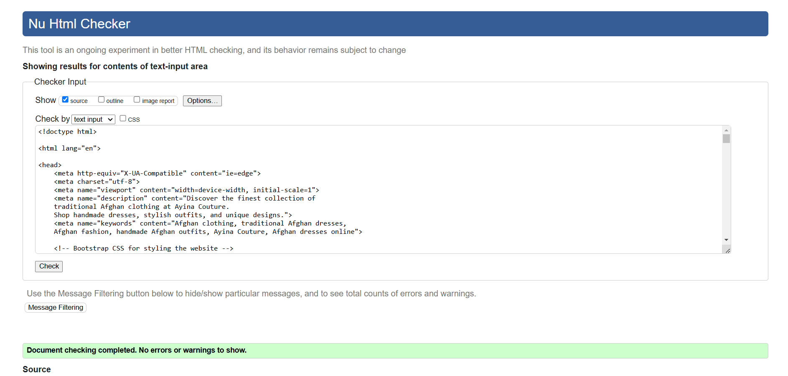

 Products Page

 Product detail Page

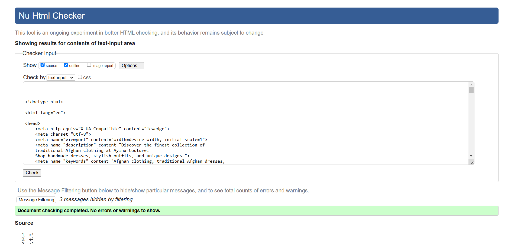

 Cart Page

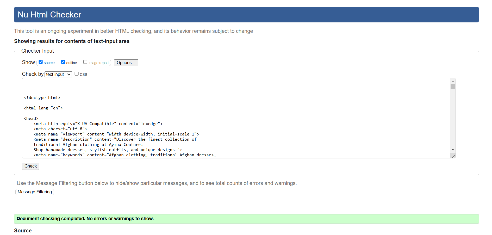

 Checkout Page

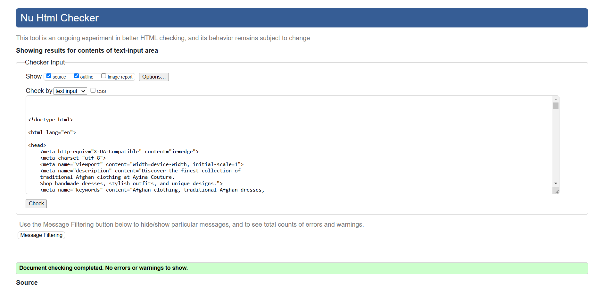

 Checkout success Page

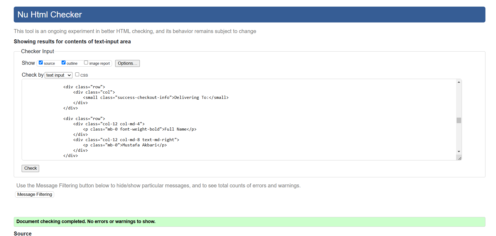

 Wishlist Page

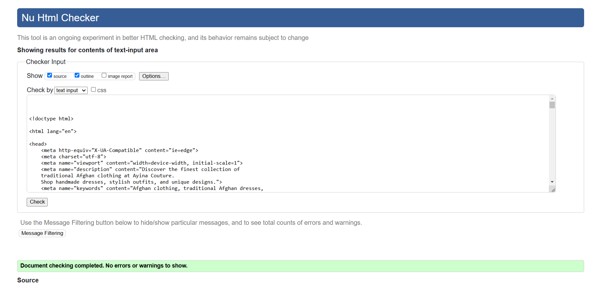

 Profile Page

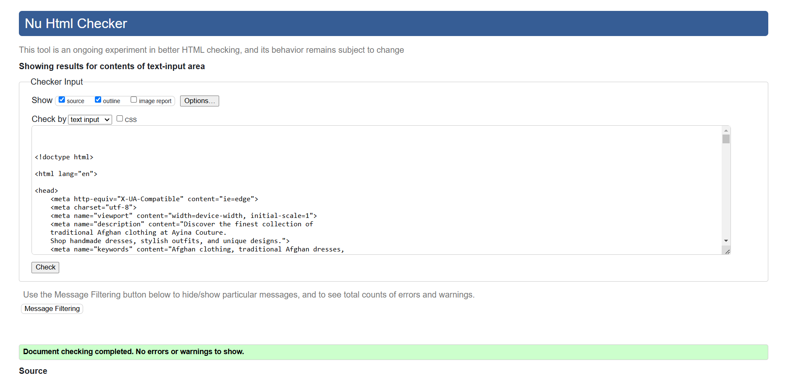

 Contact Page

 About Page

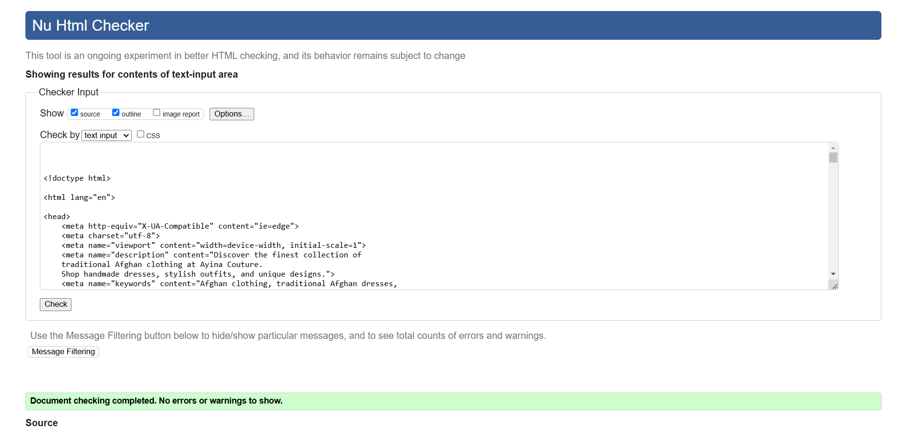

 Women category Page

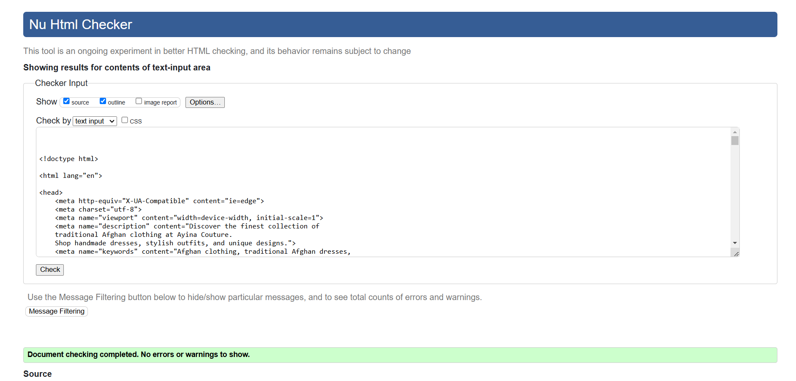

 Men category Page

 Accessories category Page

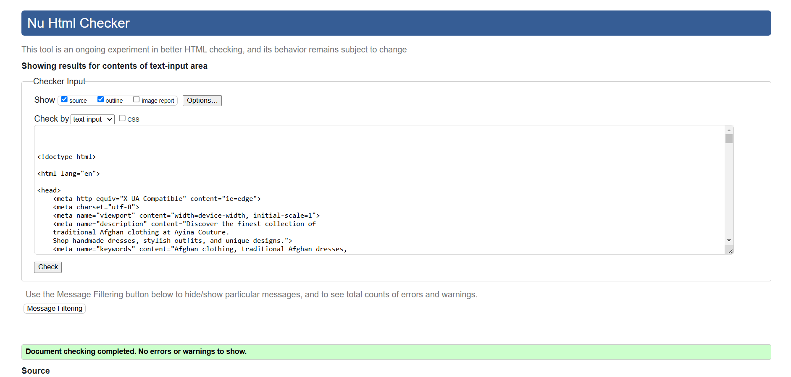

 Login Page

 Logout Page

 Signup Page

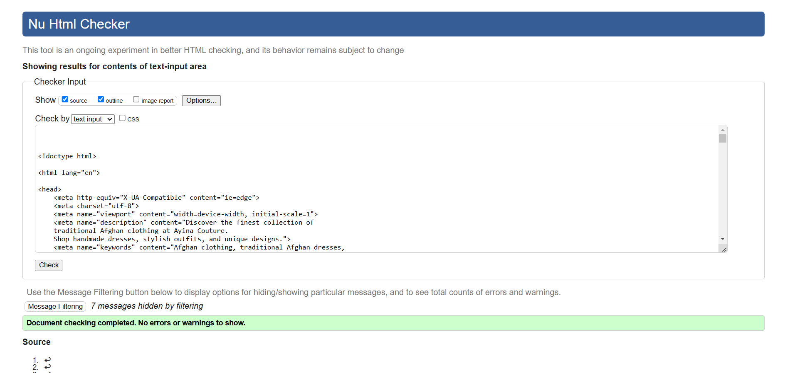

#### CSS Validation

 Custom CSS (core.css)

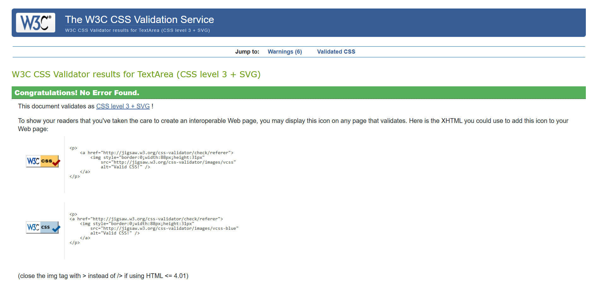

#### JS Validation

 Cart item delete confirmation

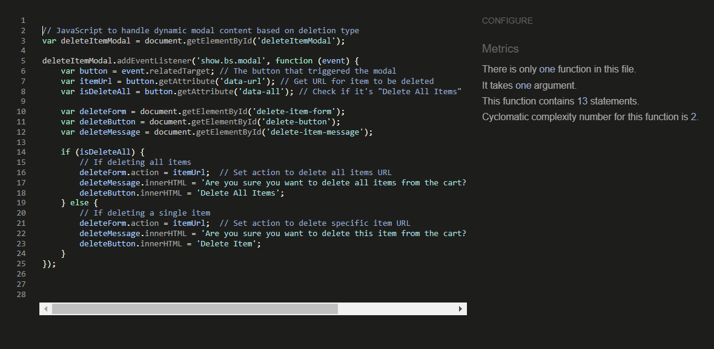

 Wishlist item delete confirmation

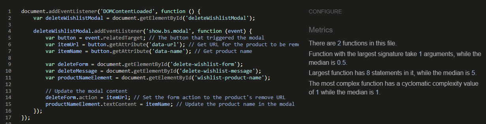

 Home popup

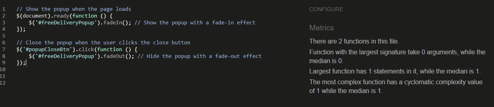

 Quantity value validation

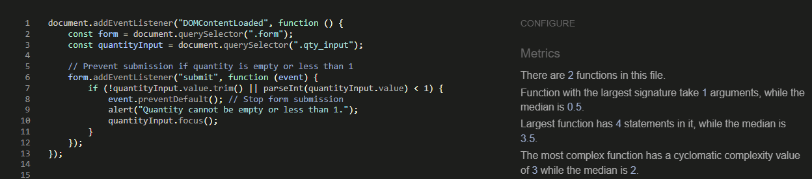

 Show toast

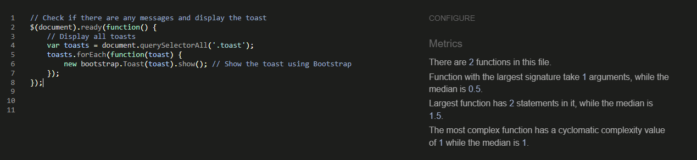

 Stripe element

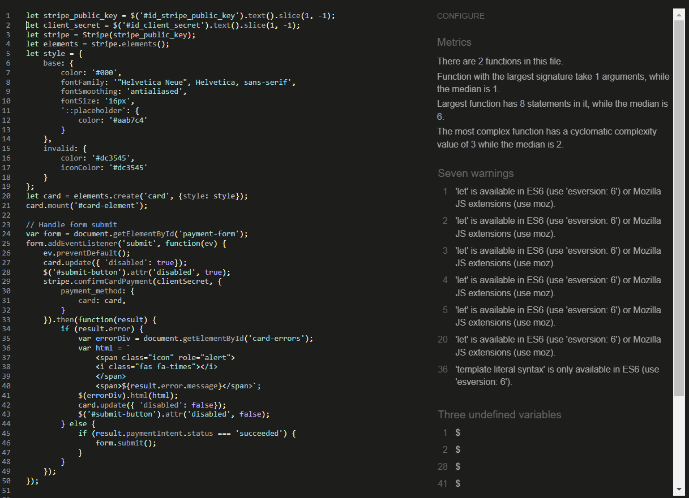

