# Testing

Return back to the [README.md](README.md) file.

Throughout the development of this project, rigorous testing was conducted to ensure the website's functionality, usability, and overall performance. This section documents all the tests performed to verify that the application operates as expected across different scenarios.

## Table of Contents
### [Responsiveness Testing](#responsiveness-testing-1)
### [Browser Compatibility Testing](#browser-compatibility-testing-1)
### [Device Testing](#device-testing-1)
### [Code Validation](#code-validation-1)
* [HTML Validation](#html-validation)
* [CSS Validation](#css-validation)
* [JavaScript Validation](#javascript-validation)
* [Python Validation](#python-validation)
### [Lighthouse Report](#lighthouse-report-1)
### [Features Testing](#features-testing-1)
---

### Responsiveness Testing
To ensure responsiveness and adaptability, the deployed website was thoroughly tested across a range of devices and screen sizes. Developer Tools were used to simulate various screen dimensions, allowing for an in-depth review of the website’s performance on different devices. Bootstrap classes and media queries were applied strategically to preserve both the design and functionality, guaranteeing a consistent and user-friendly experience on all platforms. This approach ensures that the website remains visually appealing and fully operational, regardless of the device used.

 PC

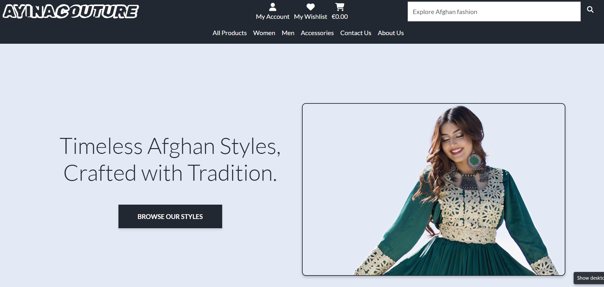

 Ipad

 Mobile

### Browser Compatibility Testing

The project was tested on Chrome and Microsoft Edge web browsers to check for compatibility issues and ensure it functions as expected across all of them. This testing process guarantees a smooth and consistent user experience, regardless of the browser used.

### Device Testing
Device testing was conducted on a variety of phone models, including Samsung Galaxy A13, iPhone 14 pro max, iPhone 15 pro and iphone 16. The assistance of family members and friends was sought to perform the testing. This comprehensive approach ensured that the website was thoroughly evaluated on different devices and platforms, contributing to a more robust and user-friendly final product.

### Code Validation 
All code was validated using industry-standard tools specific to each programming language to ensure compliance with best practices, readability, and efficiency. This process helped identify and resolve syntax errors, security vulnerabilities, and performance issues.

#### HTML Validation
I have used the recommended [HTML W3C Validator](https://validator.w3.org) to validate all of my HTML files.

 Home Page

 Products Page

 Product detail Page

 Cart Page

 Checkout Page

 Checkout success Page

 Wishlist Page

 Profile Page

 Contact Page

 About Page

 Women category Page

 Men category Page

 Accessories category Page

 Login Page

 Logout Page

 Signup Page

#### CSS Validation
I have used the recommended [CSS Jigsaw Validator](https://jigsaw.w3.org/css-validator) to validate all of my CSS files.

 Custom CSS (core.css)

#### JavaScript Validation
I have used the recommended [JShint Validator](https://jshint.com) to validate all of my JS files.

 Cart item delete confirmation

 Wishlist item delete confirmation

 Home popup

 Quantity value validation

 Show toast

 Stripe element

#### Python Validation
I have used the recommended [CI Python Linter](https://pep8ci.herokuapp.com) to validate all of my Python files.

 Home view

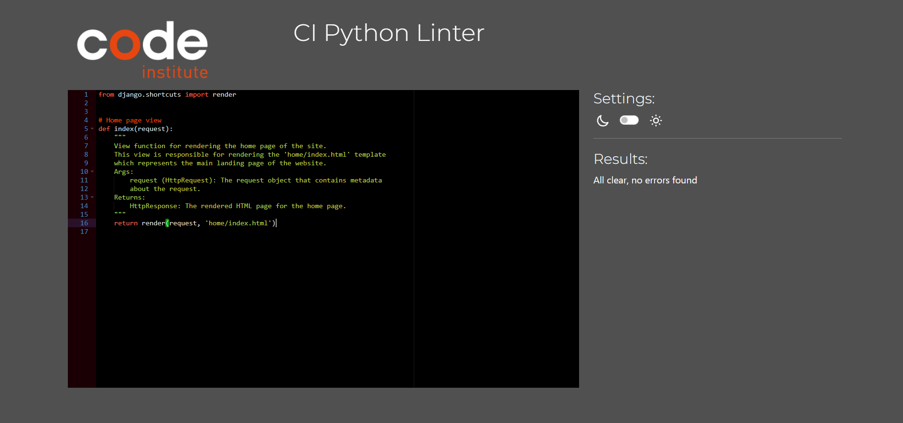

 Product view

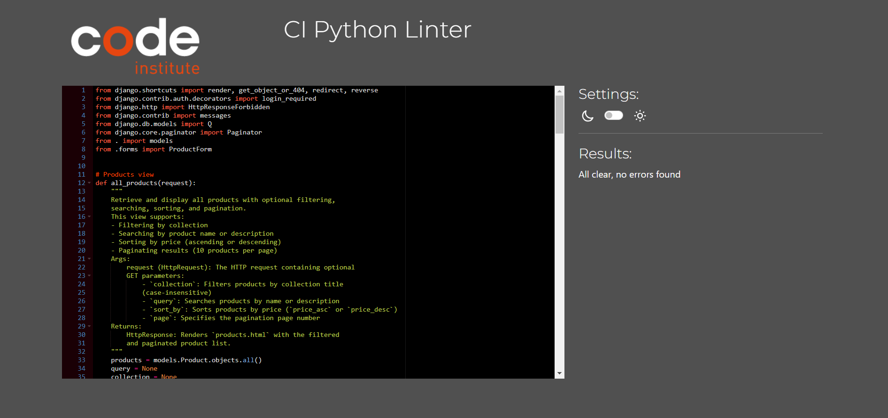

 Product model

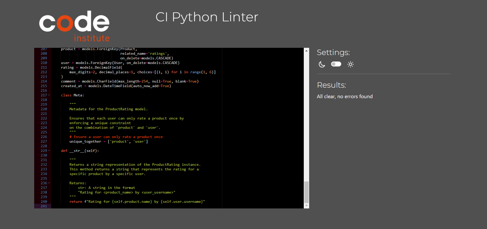

 Product url

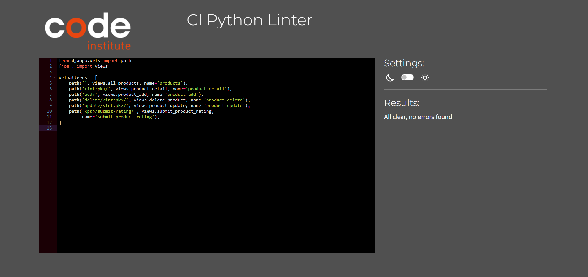

 Cart view

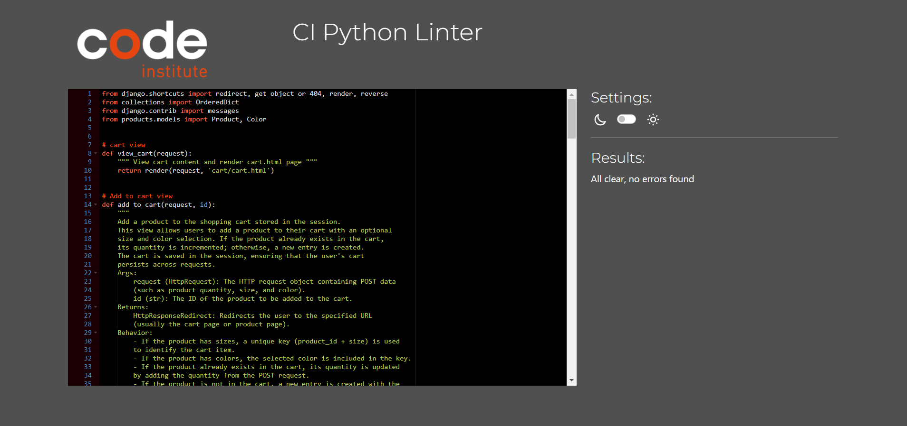

 Cart url

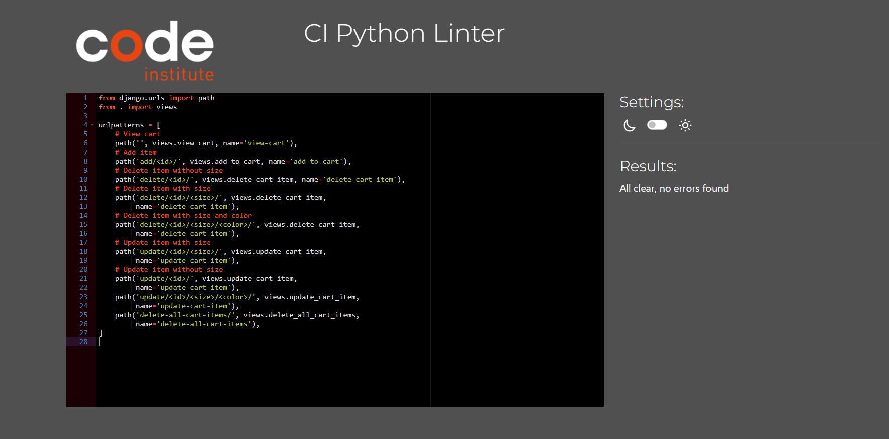

 Cart context

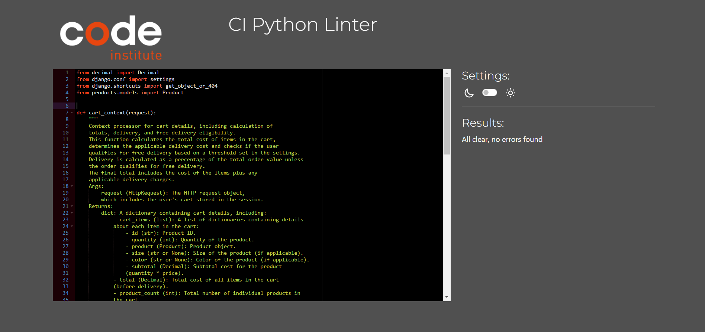

 Checkout view

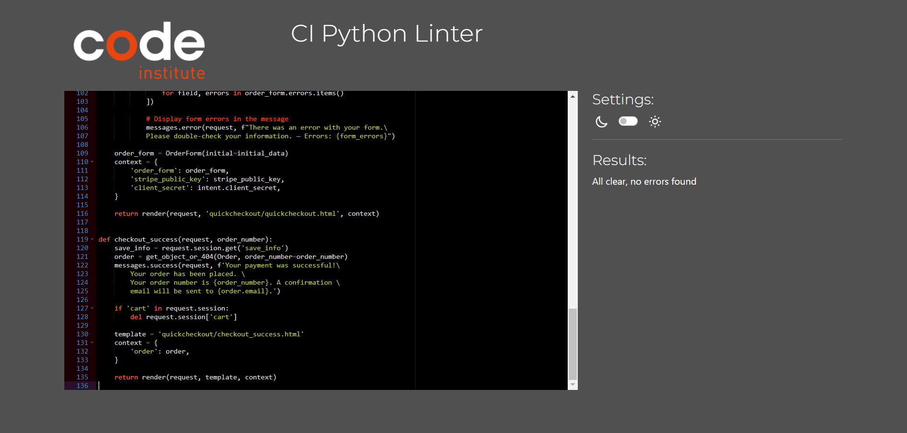

 Checkout model

 Checkout form

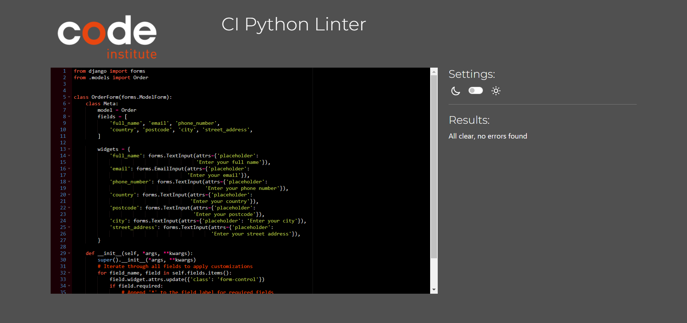

 About view

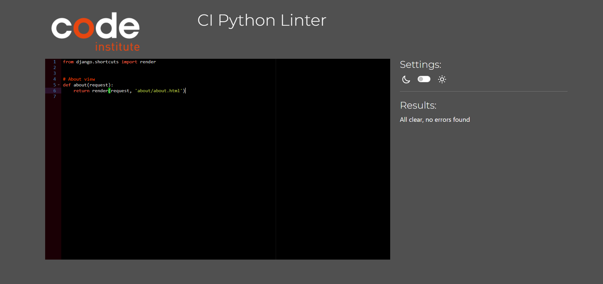

 Contact view

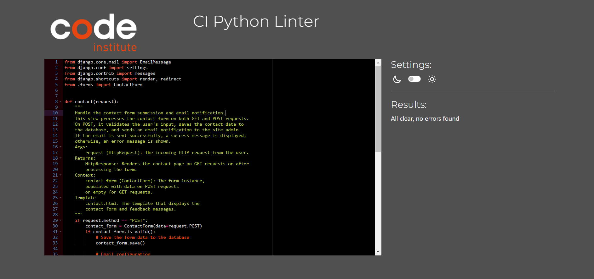

 Contact model

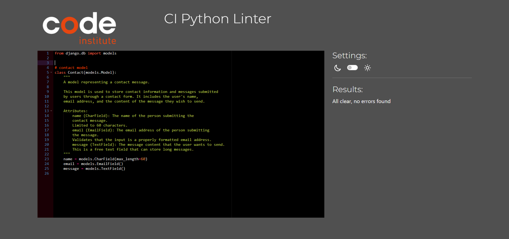

 Contact form

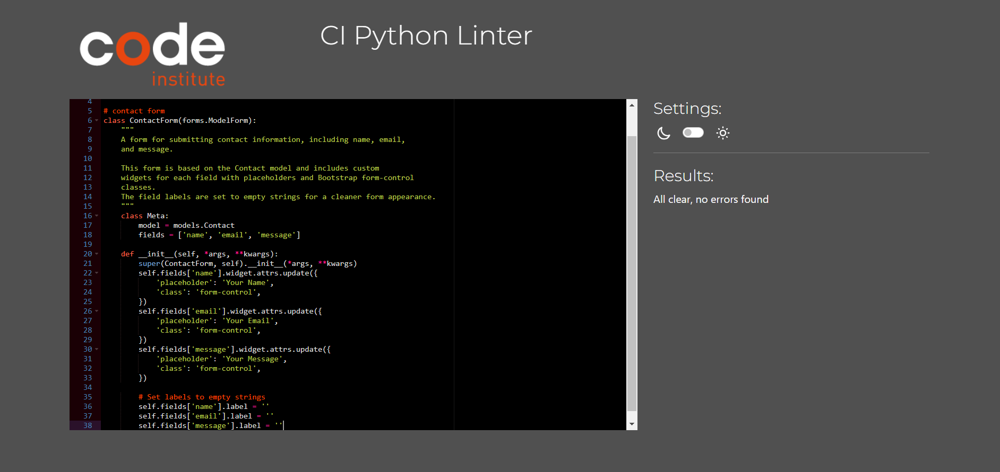

 Profile view

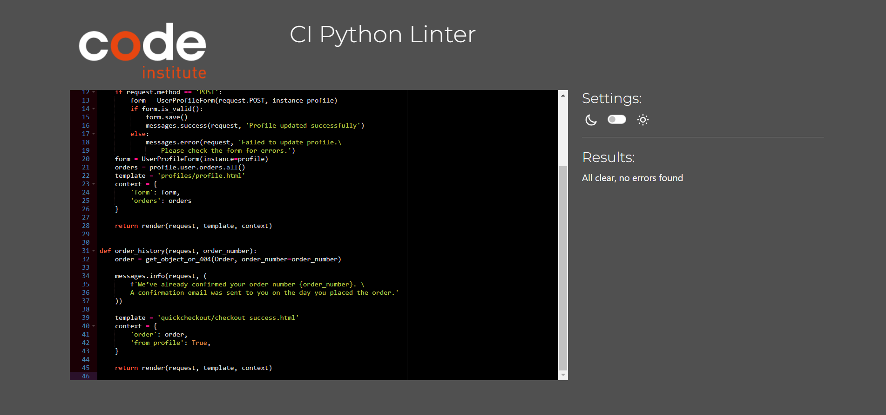

 Profile model

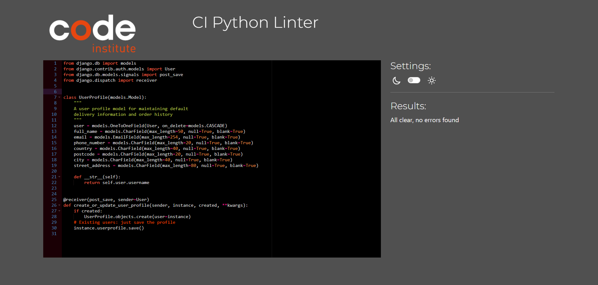

 Wishlist view

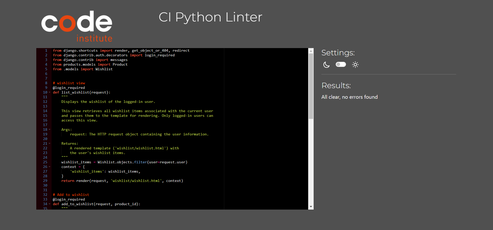

 Wishlist model

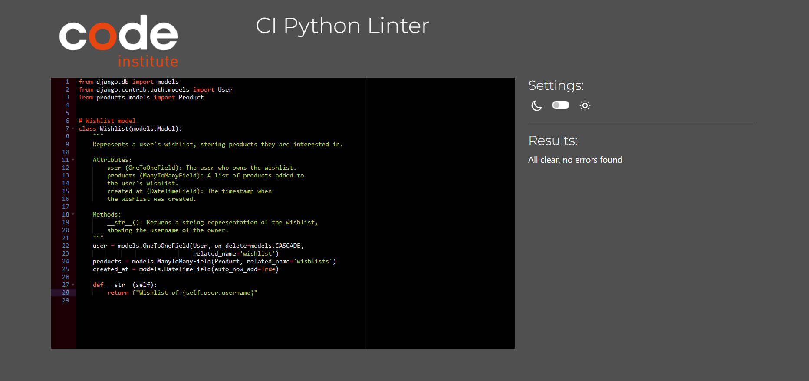

### Lighthouse Report
I've tested my deployed project using the Lighthouse Audit tool to check for any major issues.

| Page | Size | Screenshot | Notes |
| --- | --- | --- | --- |
| Home | Desktop |  |  Performance slightly affected by minor issues, but no major concerns |
| Home | Mobile |  |  Performance slightly affected by minor issues, but no major concerns |
| Products | Desktop | |  Performance slightly affected by minor issues, but no major concerns |
| Products | Mobile |  |  Performance slightly affected by minor issues, but no major concerns |
| Product detail | Desktop |  |  Performance slightly affected by minor issues, but no major concerns |
| Product detail | Mobile |  |  Performance slightly affected by minor issues, but no major concerns |
| Contact | Desktop |  |  Performance slightly affected by minor issues, but no major concerns |
| Contact | Mobile |  |  Performance slightly affected by minor issues, but no major concerns |
| Wishlist | Desktop |  |  Performance slightly affected by minor issues, but no major concerns |
| Wishlist  | Mobile |  |  Performance slightly affected by minor issues, but no major concerns |
| Sign Up | Desktop |  |  Performance slightly affected by minor issues, but no major concerns |
| Sign Up | Mobile |  |  Performance slightly affected by minor issues, but no major concerns |
| Sign In | Desktop |  |  Performance slightly affected by minor issues, but no major concerns |
| Sign In | Mobile |  |  Performance slightly affected by minor issues, but no major concerns |
| Log Out | Desktop |  |  Performance slightly affected by minor issues, but no major concerns |
| Log Out | Mobile |  |  Performance slightly affected by minor issues, but no major concerns |
| Cart | Desktop |  |  Performance slightly affected by minor issues, but no major concerns |
| Cart | Mobile |  |  Performance slightly affected by minor issues, but no major concerns |
| Checkout | Desktop |  |  Performance slightly affected by minor issues, but no major concerns |
| Checkout | Mobile |  |  Performance slightly affected by minor issues, but no major concerns |
| Checkout Success | Desktop |  |  Performance slightly affected by minor issues, but no major concerns |
| Checkout Success | Mobile |  |  Performance slightly affected by minor issues, but no major concerns |
| Profile | Desktop |  |  Performance slightly affected by minor issues, but no major concerns |
| Profile | Mobile |  |  Performance slightly affected by minor issues, but no major concerns |
| About | Desktop |  |  Performance slightly affected by minor issues, but no major concerns |
| About | Mobile |  |  Performance slightly affected by minor issues, but no major concerns |

