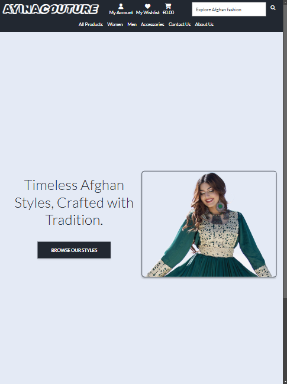
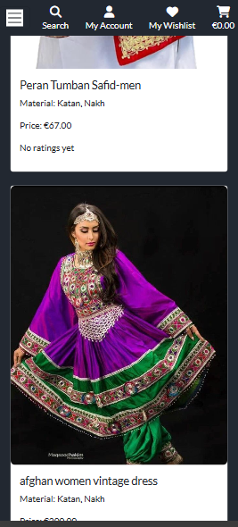
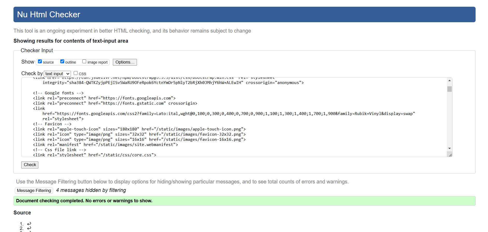

# Testing

Return back to the [README.md](README.md) file.

Throughout the development of this project, rigorous testing was conducted to ensure the website's functionality, usability, and overall performance. This section documents all the tests performed to verify that the application operates as expected across different scenarios.

## Table of Contents
### [Responsiveness Testing](#responsiveness-testing-1)
### [Browser Compatibility Testing](#browser-compatibility-testing-1)
### [Device Testing](#device-testing-1)
### [Code Validation](#code-validation-1)
* [HTML Validation](#html-validation)
* [CSS Validation](#css-validation)
* [JavaScript Validation](#javascript-validation)
* [Python Validation](#python-validation)
### [Lighthouse Report](#lighthouse-report-1)
### [Features Testing](#features-testing-1)
---

### Responsiveness Testing
To ensure responsiveness and adaptability, the deployed website was thoroughly tested across a range of devices and screen sizes. Developer Tools were used to simulate various screen dimensions, allowing for an in-depth review of the website’s performance on different devices. Bootstrap classes and media queries were applied strategically to preserve both the design and functionality, guaranteeing a consistent and user-friendly experience on all platforms. This approach ensures that the website remains visually appealing and fully operational, regardless of the device used.

 PC

 Ipad

 Mobile

### Browser Compatibility Testing

The project was tested on Chrome and Microsoft Edge web browsers to check for compatibility issues and ensure it functions as expected across all of them. This testing process guarantees a smooth and consistent user experience, regardless of the browser used.

### Device Testing
Device testing was conducted on a variety of phone models, including Samsung Galaxy A13, iPhone 14 pro max, iPhone 15 pro and iphone 16. The assistance of family members and friends was sought to perform the testing. This comprehensive approach ensured that the website was thoroughly evaluated on different devices and platforms, contributing to a more robust and user-friendly final product.

### Code Validation 
All code was validated using industry-standard tools specific to each programming language to ensure compliance with best practices, readability, and efficiency. This process helped identify and resolve syntax errors, security vulnerabilities, and performance issues.

#### HTML Validation
I have used the recommended [HTML W3C Validator](https://validator.w3.org) to validate all of my HTML files.

 Home Page

 Products Page

 Product detail Page

 Cart Page

 Checkout Page

 Checkout success Page

 Wishlist Page

 Profile Page

 Contact Page

 About Page

 Women category Page

 Men category Page

 Accessories category Page

 Login Page

 Logout Page

 Signup Page

#### CSS Validation
I have used the recommended [CSS Jigsaw Validator](https://jigsaw.w3.org/css-validator) to validate all of my CSS files.

 Custom CSS (core.css)

#### JavaScript Validation
I have used the recommended [JShint Validator](https://jshint.com) to validate all of my JS files.

 Cart item delete confirmation

 Wishlist item delete confirmation

 Home popup

 Quantity value validation

 Show toast

 Stripe element

#### Python Validation
I have used the recommended [CI Python Linter](https://pep8ci.herokuapp.com) to validate all of my Python files.

 Home view

 Product view

 Product model

 Product url

 Cart view

 Cart url

 Cart context

 Checkout view

 Checkout model

 Checkout form

 About view

 Contact view

 Contact model

 Contact form

 Profile view

 Profile model

 Wishlist view

 Wishlist model

### Lighthouse Report
I've tested my deployed project using the Lighthouse Audit tool to check for any major issues.

| Page | Size | Screenshot | Notes |
| --- | --- | --- | --- |
| Home | Desktop |  |  Performance slightly affected by minor issues, but no major concerns |
| Home | Mobile |  |  Performance slightly affected by minor issues, but no major concerns |
| Products | Desktop | |  Performance slightly affected by minor issues, but no major concerns |
| Products | Mobile |  |  Performance slightly affected by minor issues, but no major concerns |
| Product detail | Desktop |  |  Performance slightly affected by minor issues, but no major concerns |
| Product detail | Mobile |  |  Performance slightly affected by minor issues, but no major concerns |
| Contact | Desktop |  |  Performance slightly affected by minor issues, but no major concerns |
| Contact | Mobile |  |  Performance slightly affected by minor issues, but no major concerns |
| Wishlist | Desktop |  |  Performance slightly affected by minor issues, but no major concerns |
| Wishlist  | Mobile |  |  Performance slightly affected by minor issues, but no major concerns |
| Sign Up | Desktop |  |  Performance slightly affected by minor issues, but no major concerns |
| Sign Up | Mobile |  |  Performance slightly affected by minor issues, but no major concerns |
| Sign In | Desktop |  |  Performance slightly affected by minor issues, but no major concerns |
| Sign In | Mobile |  |  Performance slightly affected by minor issues, but no major concerns |
| Log Out | Desktop |  |  Performance slightly affected by minor issues, but no major concerns |
| Log Out | Mobile |  |  Performance slightly affected by minor issues, but no major concerns |
| Cart | Desktop |  |  Performance slightly affected by minor issues, but no major concerns |
| Cart | Mobile |  |  Performance slightly affected by minor issues, but no major concerns |
| Checkout | Desktop |  |  Performance slightly affected by minor issues, but no major concerns |
| Checkout | Mobile |  |  Performance slightly affected by minor issues, but no major concerns |
| Checkout Success | Desktop |  |  Performance slightly affected by minor issues, but no major concerns |
| Checkout Success | Mobile |  |  Performance slightly affected by minor issues, but no major concerns |
| Profile | Desktop |  |  Performance slightly affected by minor issues, but no major concerns |
| Profile | Mobile |  |  Performance slightly affected by minor issues, but no major concerns |
| About | Desktop |  |  Performance slightly affected by minor issues, but no major concerns |
| About | Mobile |  |  Performance slightly affected by minor issues, but no major concerns |

### Features Testing
Here are the results of the manual testing:

| Page | User Action | Expected Result | Pass/Fail | Comments |
| --- | --- | --- | --- | --- |
| **Home Page** | | | | |
| | Click on 'Browse our styles' button | Redirection to Products page | Pass | |
| **Navigation bar** | | | | |
| | Click on Logo | Redirection to Home page | Pass | |
| | Click on 'All products' link | Redirection to Products page | Pass | |
| | Click on 'Women' link | Redirection to Women category page | Pass | |
| | Click on 'Men' link | Redirection to Men category page | Pass | |
| | Click on 'Accessories' link | Redirection to Accessories category page | Pass | |
| | Click on 'Contact Us' link | Redirection to Contact page | Pass | |
| | Click on 'About Us' link | Redirection to About page | Pass | |
| | Click on 'My Account' dropdown | show 'My profile' and 'logout' link (If user is authenticated) | Pass | |
| | Click on 'My Account' dropdown | show 'Register' and 'Login' link (If user is not authenticated) | Pass | |
| | Click on 'My Wishlist' link | Redirect to Wishlist page (If user is authenticated) | Pass | |
| | Click on 'My Wishlist' link | Redirect to Login page (If user is not authenticated) | Pass | |
| | Click on 'Bascket' link | Redirect to Cart page | Pass | |
| | Click on 'Search' input and type name or some product description | Show requested product | Pass | |
| **Footer** | | | | |
| | Click on 'Home' link | Redirect to home page | Pass | |
| | Click on 'Shop' link | Redirect to products page | Pass | |
| | Click on 'Contact' link | Redirect to contact page | Pass | |
| | Click on 'Social media' links | Redirect to requested social media home page (if available)  | Pass | |
| **Products** | | | | |
| | Click on product items link | Redirect to product details page | Pass | |
| **Product detail** | | | | |
| | Fill out 'Rating inputs' and click on 'Submit rating' button  | Validate inputs, save submited rating and Redirect to product details page | Pass | |
| | Click on 'Sort' button | Show dropdown to sort by price | Pass | |
| | Select quantity, select color (if available), select size (if available) click on 'Add to cart' button  | Redirect to product detail page (show toast notification with a button to checkout) | Pass | |
| | Click on 'Add to wishlist' button |Add item to wishlist and redirect to Wishlist page | Pass | |
| **Wishlist** | | | | |
| | Click on 'View p' button | Redirect to product details page | Pass | |
| | Click on 'Trash' button | Show delete modal confirmation | Pass | |
| | Click on 'cancel' button in delete modal C| Redirect to wishlist page | Pass | |
| | Click on 'delete' button in delete modal C| Delete selected item and redirect to wishlist page | Pass | |
| **Cart** | | | | |
| | Click on 'Remove' button | Show delete modal confirmation | Pass | |
| | Click on 'cancel' button in delete modal C| Redirect to cart page | Pass | |
| | Click on 'delete' button in delete modal C| Delete selected item and redirect to cart page | Pass | |
| | Click on 'Update' button | Redirect to cart update page | Pass | |
| | Click on 'Update cart item' button in cart update page | Update cart item and redirect to cart page | Pass | |
| | Click on 'Back to cart' button in cart update page | Redirect to cart page | Pass | |
| | Click on 'Delete all items' button |  Show delete modal confirmation ( cancel or delete ), redirect to cart page | Pass | |
| | Click on 'Keep shopping' button | Redirect to products page | Pass | |
| | Click on 'Secure checkout' button | Redirect to checkout page | Pass | |
| **Checkout** | | | | |
| | Click on 'Complate order' button (after filling the form and performing form validation)  | Redirect to checkout success page | Pass | |
| | Click on 'Adjust cart item' button | Redirect to cart page | Pass | |
| **Checkout Success** | | | | |
| | Click on 'Browse our styles' button | Redirect to products page | Pass | |
| **Profile** | | | | |
| | Click on 'Update information' button | Update user information and redirect to profile page | Pass | |
| | Click on 'order number' link | Redirect to order history | Pass | |
| **Contact us** | | | | |
| | Click on 'Send message' button (after filling the form and performing form validation) | Send message and redirect to contact page | Pass | |
| **About us** | | | | |
| | Click on 'Shop now' button | Redirect to Products page | Pass | |
| **Sign in** | | | | |
| | Click on 'home' button | Redirect to home page | Pass | |
| | Click on 'google' button | Redirect to login using google provider | Pass | |
| | Click on 'sign up' link or button | Redirect to sign up page | Pass | |
| | Click on 'sign in' button (after filling the form and performing form validation and authentication) | Redirect to home page | Pass | |
| | Click on 'reset password' button | Redirect to reset password page | Pass | |
| **Sign up** | | | | |
| | Click on 'home' button | Redirect to home page | Pass | |
| | Click on 'sign in' link or button | Redirect to sign in page | Pass | |
| | Click on 'sign up' button (after filling the form and performing form validation) |Send email confirmation and redirect to confirm email page | Pass | |

